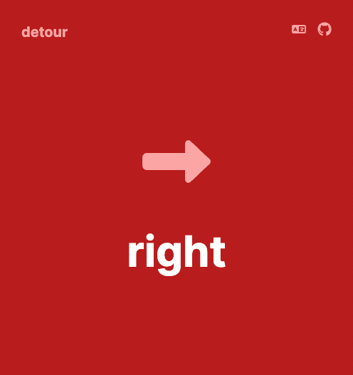
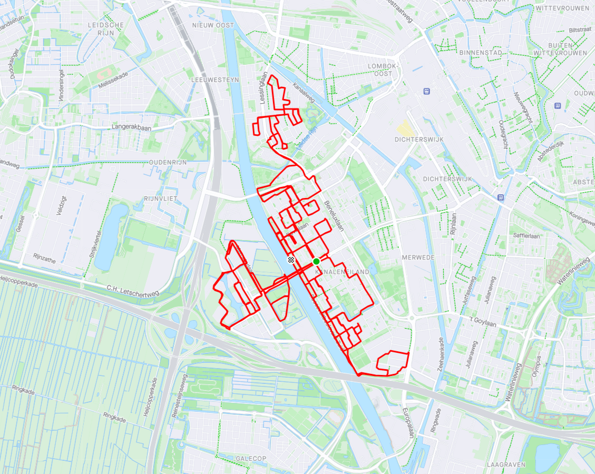

# Detour
Detour is an app that can be used to take detours when cycling. A live demo can be found [here](https://karman.dev/detour/). Simply, start cycling and whenever you reach an intersection: click somewhere on the screen to see what path to take.



## Getting Started
You can run the development server using the following command.
```bash
npm run dev
```
Next, you can open [http://localhost:3000/detour](http://localhost:3000/detour).

## Build
To build this app you can use the following command.
```bash
npm run build
```
Then, copy the `out/` directory to the server to deploy it to [https://karman.dev/detour/](https://karman.dev/detour/).

## Author
Created by [Simon Karman](https://www.simonkarman.nl).

--- 

In the following image you can see the first ever detour in Utrecht, Netherlands by Simon Karman and Matt Watson.


